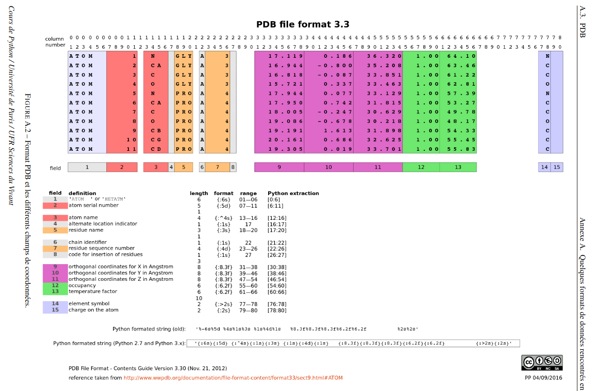

#PDB files of the 3 proteins used as example by the program SASA:

## 1bzv (INSULIN ANALOGUE)
Protein of 46 amino acids 
 
## 1rex (LYSOZYME)
Protein of 130 amino acids

## 1si4 (HUMAN HEMOGLOBIN)
Protein of 574 amino acids

#PDB (Protein Data Bank) file: 

